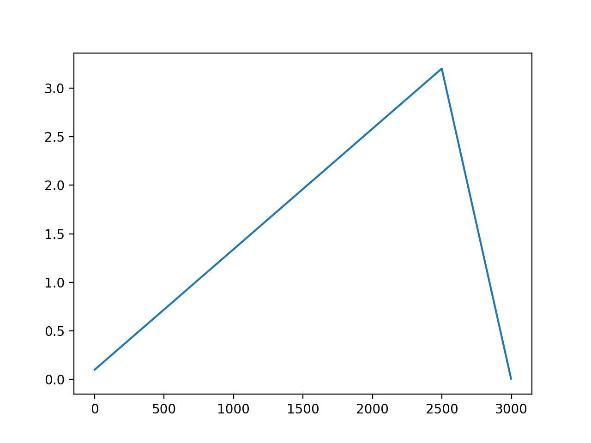

# PyTorch WarmUp

Implementation of Gradual WarmUp in PyTorch proposed in [Accurate, Large Minibatch SGD: Training ImageNet in 1 Hour](https://arxiv.org/abs/1706.02677).

In addition to WamUp it also includes a module to combine several learning rate schedulers with corresponding number of steps for each of them.

## How to use

```python
from torch_warmup import WarmUpScheduler


model = ...
optim = SGD(model.parameters(), lr=0.01)
scheduler_warmup = WarmUpScheduler(...)
# Typical train loop with PyTorch Scheduler
...
```

## Examples

Some images of different learning rate schedulers.

* WarmUp and Cosine

```python
WarmUpScheduler.with_cosine_stage(
    optimizer=optim,
    warmup_steps=2600,
    num_training_steps=3000
)
```


* WarmUp starting from 0.1 and Linear after that

```python
WarmUpScheduler.with_linear_stage(
    optim,
    warmup_steps=2500,
    starts_with=0.1,
    num_training_steps=3000
)
```



* WarmUp starting from 0.1, some constant steps and Linear

```python
WarmUpScheduler(
    optim,
    warmup_steps=2500,
    add_constant_steps=100,
    starts_with=0.1,
    after_warmup_scheduler=LambdaLR(
        optim,
        lr_lambda=lambda step: max(0.0, (3000 - step) / max(1.0, 3000 - 2600))
    )
)
```


* And something bizarre using `CombineScheduler`

```python
CombineLRSchedulers(
    lr_schedulers=[
        LambdaLR(
            optim,
            lr_lambda=lambda step: step / max(1.0, 20),
        ),
        CosineAnnealingLR(
            optim,
            T_max=50
        ),
        LambdaLR(
            optim,
            lr_lambda=lambda step: max(0.0, (100 - step) / max(1.0, 100 - 50))
        ),
        StepLR(optim, step_size=1, gamma=0.9)
    ],
    lr_schedulers_steps=[20, 30, 30]
)
```


